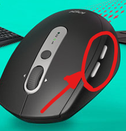

# **AHK-SysUtil** 帮助文档

### **一款基于 AutoHotkey 的 Windows 系统增强脚本**


本文档地址（如果您电脑中没有 markdown 查看器）：https://github.com/BH2WFR/AHK-SysUtil-Document


#### **项目主页** Homepage：

​	https://github.com/BH2WFR/AHK-SysUtil

#### 更新发布 Release：

​	https://github.com/BH2WFR/AHK-SysUtil/releases


------

## 使用前的准备

### 启动脚本

​	双击  `main.ahk` 即可启动**「脚本版」脚本**。「脚本版」脚本不支持设置开机自启，请注意启动脚本时确保在 "main.ahk" 所在文件夹下有装有主要代码的 "src" 文件夹和装有图片的 "res" 文件夹，否则脚本无法启动。

​	双击打包的 `exe` 文件即可启动**「打包版」脚本**。「打包版」脚本可以设置开机自启，建议不要随意挪动 exe 文件的位置。

​	**脚本启动时会申请管理员权限**，用户请在弹出的UAC窗口中**同意以管理员权限启动脚本**，否则脚本的大多数功能无法正常运行。


### 进入设置界面

​	单击或双击托盘图标  ，或按下 `Caps+Shift+F1` 即可弹出设置界面，**请仔细阅读下面的小节**。


### ✱ 初装脚本后需要做的操作

​	初装脚本后，需要在设置界面第二选项卡「**功能设置**」中选择以下项目：

1. 点击「**向注册表写入按键映射**」按钮，以通过注册表**将 `CapsLock` 键重映射到 `F24`，`RAlt` 键映射到`F23`**（此功能需要**重启计算机以生效**）。此外还有其他两种方法设置这两个键的按键映射：

     1）使用 **SharpKeys** （https://github.com/randyrants/sharpkeys）等工具手动像注册表中设置按键映射，将 `CapsLock` 映射到 `Unknown: 0x0076 (00_76)`，`Right Alt` 映射到 `Function: F23 (00_6E)`，并需要**重启计算机**。

     

     2）使用 **Powertoys** （https://github.com/microsoft/PowerToys） 等工具提供的按键映射功能，不写入注册表，无需重启电脑即可体验本脚本的所有热键，但其运行稳定性可能不如注册表按键映射，如在一个无响应的窗口上可能会导致按键映射无效。请注意应当以管理员权限运行 Powertoys。

     

     3）如果您的机械键盘支持按键编程，也可以通过机械键盘设置工具来实现。

     

     

2. 设置**脚本开机自启**（仅支持在打包版中设置，脚本版不支持！），建议在下拉框中选择「**在本用户下设置开机自启**」。

     

3. **设置中文输入法快捷键**，其他输入法请设置前四个下拉框；如果您使用小狼毫输入法，请额外设置第五个下拉框。

   

   

   

4. 在系统语言设置中**添加**「**英语-美国-qwerty**」布局；

     

5. 进入 Windows 设置，查找「输入法语言快捷键」设置项，在弹出窗口中**关闭「Ctrl+Shift」输入法切换热键**，否则可能导致本脚本个别功能运行时，输入法状态会不断地切换。

6. 本脚本**支持韩文输入法下的韩英切换和汉字输入**。您可以在设置界面中设置韩文输入法的各个快捷键，并在系统输入法设置界面中设置韩文的键盘布局。默认根据 103/106 布局，进行韩英切换和汉字输入时，脚本输出标准键盘不存在的专用 `한/영` 键和 `한자` 键，可在设置界面中将其调整为 `右 Alt` 和 `右 Ctrl`。`全角/半角` 快捷键在 Win10 及以上版本的操作系统中为 `Alt+=`，在旧版本操作系统中为 `Alt+Shift+=`。


### 在杀毒软件中将本脚本放入白名单

​	有些带有主动防御功能的杀毒软件（如卡巴斯基）可在本脚本运行时对其报毒，此时需要**将脚本或打包的 exe 文件手动放入杀毒软件白名单中**。本脚本源码开源，作者保证其中没有任何恶意代码。


### 什么是 RAlt Mode？如何切换？

​	本脚本为了在键盘有限的按键中映射出大量的功能，将 **RAlt 对应的热键分为了多组**，用户需要切换这些「模式」以实现对应的功能。如 `RAlt Mode 1` 中的 `RAlt 热键` （右侧 Alt+键盘其他按键) 多为编程时需要的符号和代码块快捷输入和鼠标、窗口操作，RAlt Mode 2 中安排了为特殊符号输入热键，`RAlt Mode 3` 中安排了扩展拉丁字母输入热键。此外，为适应一些欧洲键盘布局，从 0.3.6.1 版本起新增 `Ralt Mode 0`，用户按下 `RAlt 热键`，脚本会根据用户设置输出真正的 `右 Alt+(Shift)+字母/符号` 或 `AltGr+(Shift)+字母/符号`。

​	在 `RAlt Mode 2`、`RAlt Mode 3` 中额外分配了大量的 “**二级热键**”，以扩展热键的数目；如在 `RAlt Mode 2` 中按下 `/ + 3` 则可输出 "**∛**"，在 `RAlt Mode 3` 中按下 `/ + Shift + A` 则输出 "**Á**", 按下 `' + O` 则输出 "**ö**"。但是这样也导致了对应的按键单独按下时需要松开才能触发原本的符号，所以在编程时带来了一系列的麻烦，如在 `RAlt Mode` 3 中无法快速输入数字，此时需要使用没有二级热键的 `RAlt Mode 1`。

​	此外，在 `RAlt Mode 2` 中设置了一系列的**热字串**，开启热字串功能后可通过热字串输入另外一大批的特殊符号，如输入"`\13`" 后按下空格或回车则可输入分数 "**⅓**"，输入 "`\pi`" 则输出希腊字母 "**π**"，输入 "`\neq`" 则输出数学符号 "**≠**"。可以通过任务栏托盘菜单或 `Caps + Shift + -` 来开关热字串功能。

​	`RAlt Mode 1` 中有 ”**下划线——减号交换功能**“，用于一些特殊场合，开启后 `-` 和 `Shift + -(_)` 的作用将会交替。可以通过任务栏托盘菜单或 `Caps+-` 开启关闭此功能。此外开启 CapsLock 大写锁定后，在 `RAlt Mode 1` 中也会自动交换减号和下划线，以方便输入 C/C++ 宏定义。

​	**可以通过按下 `RAlt+Caps`（必须先按住 `RAlt`，再按下 `Caps`）或 `RAlt+Shift+Caps` 来前后轮换 RAlt Mode，也可以通过 `RAlt+Esc/F1/F2/F3` 来切换。此外还允许通过托盘菜单来切换 RAlt Mode 和一些特殊开关。**


​	本脚本任务栏图标随着 RAlt Mode 变化，样式如图：


### 文档中的部分按键术语

 1. 数字小键盘 `Numpad 0~9` `NumpadDiv` `NumpadMul` `NumpadMinus` `NumpadPlus` `NumpadEnter` `NumpadDot` 如图所示：

    

2. `方向键`：指键盘上 `↑/←/↓/→` 四个方向键，本文中也会将这四个方向键称为 `Up/Left/Down/Right`；

3. `Caps`：指脚本重映射后的 `CapsLock` 键，按住`CapsLock`，再按下 `其他按键` 或 `Shift+其他按键`，即可触发对应的功能；

4. `RAlt`：右侧 `Alt` 键，同样根据 `RAlt Mode` 适配了不同的热键功能；

   

   

    1. `鼠标前进/后退键`：也叫 `XButton2` 和 `XButton1`，或 `鼠标测键`，是指一些多功能鼠标大拇指处多出的两个按键，默认按下时可根据当前活动程序智能触发 `前进/后退` 功能，默认为输出 `Alt+Left/Right` 快捷键，如需输出原始的 `XButton1/2`，请按 `Shift+鼠标测键`。
   
       注：在 Explorer, XYPlorer, Q-Dir, totalCmd, OneCommander 等文件管理器中，`Shift+鼠标侧键` 将会映射为「**上一级目录**」`Alt+Up`。




------

## 功能介绍（标 "★" 为特色功能）

### 剪贴板——高级粘贴功能

#### ★复制 windows 路径

​	`Caps+Shift+V` ：用于复制 windows 路径到 json、cmake 等语言中，并**转换其中的引号或正反斜杠**，使用方法如下：

 1. **复制一段路径**，方法任选其一：

    1) 可以在资源管理器地址栏中复制；

    2) **直接在文件管理器中复制单个或多个文件**（v0.3.4 起支持同时粘贴多个以换行符分隔的路径），

    3) 在任何**文件上右击，在右键菜单中点击「复制为路径（Copy as Path）」**；

    4) 在CMake、json等文件中复制任意一段**以盘符或 "./" ".\\" 开头的**绝对或相对路径。


 2. **按下热键** `Caps+Shift+V`，在随后弹出的输入框中（必须保证复制的是一段盘符如 `C:/` `C:\`或以 `./` `.\` `../` `..\` 开头的绝对或相对路径，否则不会弹出这个输入框）**输入您想要的文字处理方式对应的数字序号**。注意在从按下热键到输入框弹出的这一段几十毫秒的时间中，请不要操作键盘或鼠标，以免造成不可预料的后果。

    **注**: **在 cmake-gui 等部分程序中**，如果您复制的是一段路径，并按下了 `Caps+Shift+V`，将不会弹出窗口, 而是直接将其中反斜杠 `\` 全部转化为正斜杠 `/` 并原位粘贴。


​	下列列出文字处理方式：

```
原文：	  "D:\Projects\3rdlibs\fmt-10.0.0\lib\fmt.lib" 	  （带引号，反斜杠）
“0”：	D:\Projects\3rdlibs\fmt-10.0.0\lib\fmt.lib 		（去引号，正斜杠）
“1”：	D:/Projects/3rdlibs/fmt-10.0.0/lib/fmt.lib 		（去引号，反斜杠）
“2”：	D:\\Projects\\3rdlibs\\fmt-10.0.0\\lib\\fmt.lib （去引号，双反斜杠 json等）
“3”：	"D:\Projects\3rdlibs\fmt-10.0.0\lib\fmt.lib"	（加引号，这里没有变化）
“4”：	D:\Projects\3rdlibs\fmt-10.0.0\lib\fmt.lib 		（反斜杠，这里只去掉引号）
注：后五行为在弹出的输入框中输入对应数字后粘贴的结果

原文：	D:/Projects/3rdlibs/fmt-10.0.0/lib/fmt.lib		（无引号，正斜杠）
“3”：	"D:/Projects/3rdlibs/fmt-10.0.0/lib/fmt.lib"	（加引号）
“4”：	D:\Projects\3rdlibs\fmt-10.0.0\lib\fmt.lib		（无引号，反斜杠）

原文：	.\Projects/3rdlibs/fmt-10.0.0/lib/fmt.lib		（"./" 开头的相对路径）
“3”：	"./Projects/3rdlibs/fmt-10.0.0/lib/fmt.lib"		（加引号）
“4”：	.\Projects\3rdlibs\fmt-10.0.0\lib\fmt.lib		（无引号，反斜杠）
```

​	粘贴效果图：


#### ★从 PDF 论文中复制大段文章

​	`Caps+Shift+V`，与之前介绍的 windows 路径粘贴功能热键相同。有时**从 pdf 阅读器中复制一段文章时，粘贴过去后可能出现每一行文字后都有换行符的现象**，如图所示；此时可**用此功能进行粘贴，可以看到粘贴时自动去除了这些换行符**。但是在原文分段的地方仍需要注意，本脚本无法识别段落，只能通过判断每一行最后一个字符是否为句号来推测分段，因此粘贴时段落可能有些于原文不同。


​	

​	使用本高级粘贴功能粘贴后的效果如下，可以看到**多余的行末换行已经得到了清除**，也可以**通过句号识别可能的分段**，但也由于这样粗糙的段落识别方式导致了可能有多余的行，需要后续手工核对去除。


​	此外，使用**高级粘贴功能**粘贴文本时，还会做到以下几点：

1. 	所有**全角字符转化为半角字符**；
2.     所有**非常规空格**（全角空格、em空格、不间断空格）等**全部转化为普通空格**；
3.     所有 "ff" "fi" 等的**英文合字**将会被**拆开**为普通的 "ff" 和 "fi" 等；

​	这样在粘贴大段文献或网页文本时可起到一定的帮助作用。


#### 从浏览器地址栏 URL 中只摘取域名并粘贴

​	热键仍然为 `Caps+Shift+V` ，可将浏览器地址栏中的完整网址路径只保留其域名再粘贴。


-------------------------

### 剪贴板——其他功能

#### 其他快捷键

​	`Caps+C`：复制；

​	`Caps+Shift+C`：**复制本行所有内容**, 在 explorer 等文件管理器窗口下，选中文件/文件夹后按下此热键进入 **软链接生成器**；

​	`Caps+X`：剪切；

​	`Caps+Shift+X`：**剪切本行所有内容**, 在 explorer 等文件管理器窗口下，选中文件后按下此热键进入 **文件 Hash 值查看器**；

#### ★去格式粘贴（纯文本粘贴）

​	`Caps+V`：★**无格式粘贴**，可将从网页或 word 中复制的**带有格式的文本，去除所有格式后只粘贴纯文本**。

​	可在设置界面中设置按下 `Caps+V` 无格式粘贴时是否去除前后空白字符（空格或制表符）。默认在 Onenote 笔记软件中**会将复制内容中的 Tab 制表符转换为空格**，用以方便粘贴代码；如需在所有程序中启用此功能，可以在设置界面中启用。


​	**文件路径复制功能**：在 explorer 等文件管理器复制文件/文件夹后，在记事本等文本框中按下 `Caps+V` 无格式粘贴，将会**粘贴文件或文件夹的路径**，如有多个文件/文件夹，则会分为多行。


#### 使用第二套剪贴板

​	`RAlt Mode 1` 下,   `RAlt+X`   `RAlt+C`   `RAlt+V`。注意：只能复制粘贴**纯文本**内容。


------------------

### 窗口管理功能

#### ★窗口强行居中

​	`Caps+R`：可**将当前活动窗口强行移动到主显示器屏幕正中间**，适用于一些笔记本连接副屏时，由于一些**窗口移动到了屏幕外侧导致找不到**的情况。

​	在 `Caps+M` 鼠标模式中，按下 `[` 也可以触发此功能。


#### 窗口大小重置

​	`Caps+Shift+R`：可**将过大的窗口强行调整到适当的大小**，并移动到主显示器屏幕正中间。

​	在 `Caps+M` 鼠标模式中，按下 `]` 也可以触发此功能。


#### 自由移动窗口

​	`RAlt Mode 1` 下，`RAlt + E/S/D/F` 可实现窗口自由移动，但是不能移出主显示器显示范围。

​	在 `Caps+M` 鼠标模式中，`E/S/D/F`  或`NumpadDot + Numpad 8/4/2/6（数字小键盘）`（慢速），或 `A + E/S/D/F` （快速）也可自由移动窗口。

​	窗口移动的速度可在设置界面中设置。


​	注：由于当电脑连接了多个缩放率不同的显示器时，在显示器之间移动窗口会出现不可预料的 bug，故本脚本移动窗口功能**仅允许在主屏幕范围内移动窗口**，不可以将窗口的任何部分移出主屏幕显示范围外。


#### 改变窗口大小

​	 `Caps+Shift+W`：并在输入框中依次输入宽、高，输入时可输入 "+30" "-40" 之类的增量，也可以输入绝对像素长度。

​	在 `Caps+M` 鼠标模式中，按下  `;` 也可触发此功能。

​	`RAlt Mode 1` 下，`RAlt + Shift + E/S/D/F` 可实现窗口大小的自由改变，**但同样也不允许将窗口边缘移动到主显示器屏幕外侧**。


#### ★置顶窗口

​	切换**窗口置顶**状态：`Caps+T`

​	`Caps+M` 鼠标模式中，按下  `P` 置顶窗口。


#### ★调整窗口透明度

​	在活动窗口上（一定要让窗口激活放到前台，而不是仅仅把鼠标指针放到窗口上）**按住 `Win` 后上下滚动鼠标滚轮**，可调整当前活动**窗口的透明度**，按下 `Win+鼠标中键` 或 `Caps+Shift+T` 恢复不透明。


#### 最小化其他窗口/显示桌面

​	最小化其他窗口（除当前活动窗口外）：`Caps+D`

​	显示桌面（最小化所有窗口）：`Caps+Shift+D`


#### 最大化/还原/最小化 窗口

​	`RAlt Mode 1`  下，`Caps+W` 切换窗口最大化/还原状态

​	`RAlt Mode 1`  下，`Caps+Shift+W` 最小化当前活动窗口


#### ★查看窗口信息/查找窗口

​	`Caps+W`：（**特色功能**）会弹出一个窗口，内有当前活动窗口的进程名、路径、句柄、状态、控件等各项信息，详情见图。

​	本功能也可以用来查看其他窗口的信息，此时需要在弹出的窗口中点击左侧「刷新列表」按钮，然后点击下拉框选择您要查看的窗口，然后点击「查找」按钮，下面的文本框中会显示出对应窗体的信息。双击列表中的项目，即可将其内容复制到剪贴板中。

​	**注**：

1. 本功能给出的信息**仅供参考**，**如需获取详细的窗口和控件信息，请下载** https://www.autohotkey.com/boards/viewtopic.php?t=28220 由 AutoHotkey 编写的窗体信息查看器 **WinSpy**。

1. 加载窗体信息**需要几秒钟时间**，此时脚本可能出现「假死」现象，此时请耐心等待几秒钟，加载完毕后列表中将出现图中内容。

1. 在「窗体列表] 下拉框中，有可能出现部分窗口出现在两行上的情况，此时请点击第一行（下拉框分行是通过 `|` 符号来分隔的，如窗口标题含此符号可能被认作是两行）。

    界面如图：


#### 前进/后退 标签页

​	`Caps+鼠标前进/后退键`：输出 `Ctrl+Tab` 和 `Ctrl+Shift+Tab` 以方便前后在部分多标签窗口中前后翻动标签页，松开 `CapsLock` 键结束翻动。


#### 切换窗口

​	`RAlt+鼠标前进/后退键`：输出 `Alt+Tab` 和 `Alt+Shift+Tab` 以方便在打开的窗口之间进行切换，松开 `RAlt` 键结束切换。


#### 切换桌面（Windows 10+）

​	`Caps+Shift+鼠标前进/后退键`：输出 `Ctrl+Win+Left` 和 `Ctrl+Win+Right` 以方便在多桌面中前后切换（Windows 10 及以上版本）。


-------------------------

### 鼠标键盘功能

#### 快速/横向 滚动鼠标滚轮

​	**快速滚动**：`Caps+鼠标滚轮`

​	极速滚动：`Caps+Shift+鼠标滚轮`

​	**横向滚动**：`RAlt+鼠标滚轮`

​	横向快速滚动：`RAlt+Shift+鼠标滚轮`

​	注：此功能有工作不够稳定的可能，故**请勿过快地滚动鼠标滚轮**，如出现问题请重启脚本。鼠标滚动的速度可以在设置界面中进行设置。


#### 使用键盘操作鼠标滚轮

​	`Caps/RAlt + PgUp/PgDn`： 纵向滚动，按下 `shift` 加速滚动

​	`Caps/RAlt + Home/End`： 横向滚动，按下 `shift` 加速滚动

​	在 `Caps+M` 鼠标模式中，`T/G/PgUp/PgDn/Numpad9/Numpad3` 可实现滚轮纵向滚动，按下 `a/NumPad0` 加速滚动

​	在 `Caps+M` 鼠标模式中，`V/B/Home/End/Numpad7/Numpad1` 可实现滚轮横向滚动，按下 `a/NumPad0` 加速滚动


#### ★使用键盘操作鼠标

​	`RAlt Mode 1` 中，`RAlt+I/J/K/L` 可以以**较快的速度移动鼠标指针**，如需要像素级地慢速移动鼠标指针，应加入 `Shift` 键。（当电脑连接了缩放率不同的多个显示器时，可能无法正常逐像素移动鼠标指针)

​	`RAlt Mode 1` 中，`RAlt+U/O` 可输入鼠标**左键和右键**，但是**不支持拖动**操作，如需拖动请使用 `Caps+M` 鼠标模式。


#### ★鼠标模式——像素级移动鼠标指针

​	按下 `Caps+M` 可**进入鼠标模式**，此时托盘图标将变为「」，按 `Esc` 或  `Q`  退出。

​	在其中，`I/J/K/L/方向键` 或 `NumPad 8/4/2/6` 可以**像素级慢速移动鼠标指针**，`a + I/J/K/L/方向键` 或 `NumPad0 + NumPad 8/4/2/6/方向键` 可**快速移动鼠标指针**。（当电脑连接了缩放率不同的多个显示器时，可能无法正常逐像素移动鼠标指针)

​	`W/U/Space/Enter/NumpadEnter` 对应鼠标**左键**，`R/O/AppsKey/NumpadPlus` 对应鼠标**右键**，`Y/N/NumpadMinus` 对应鼠标中键，可**支持拖动操作**，可以尝试一下按住 `W` ，然后再按下 `A + I/J/K/L` 进行拖动。 

​	在 `Caps+M` 鼠标模式中，按下 `Z` 将鼠标指针移动到 (0,0) 处，按下 `C` 或 `Numpad5` 将鼠标指针移动到主显示器屏幕正中间，按下 `X` 或 `NumpadMul` 弹出输入框输入要移动到的座标。

​	 在 `Caps+M` 鼠标模式中，正常的键盘鼠标输入被软件屏蔽，如需**退出请按** `Esc / Q / NumpadDiv`。


#### 查看当前鼠标指针所在的绝对和相对坐标

​	同样，可以按下  `Caps+M`，进入鼠标模式，在弹出的提示条第一行有当前鼠标指针的**绝对**（基于屏幕(0,0)点）和**相对**（基于活动窗口左上角）坐标，可用于编写自动点击脚本时确定坐标之情况。此外，在 `RAlt Mode 1` 中，使用 `RAlt + I/J/K/L` 移动鼠标指针时，也会给出鼠标指针的坐标信息。


#### 切换 CapsLock、ScrollLock 和 NumLock

​	由于本脚本需要将 `CapsLock` 映射到 `F24` 作为热键，会使 `CapsLock` 键失去原有的大写锁定功能。本脚本另作了一系列快捷键以补偿：

​	`Caps+A` 或 `Caps+Insert`：切换 **CapsLock**

​	`Caps+Shift+A`  或 `Caps+Shift+Insert`：切换 **NumLock**

​	`Caps+Shift+P`：切换 **ScrollLock**


#### 发送某些精简配列键盘中没有的按键

​	**Pause**：`Caps+P`

​	(Shift)+(Ctrl)+**Insert**：`Caps+(Shift)+(‍Ctrl)+RAlt`  (必须先按住 `Caps` 再按 `RAlt`，同时再按住 `Ctrl` 或 `Shift` 可输出 `Ctrl/Shift + Insert`（复制粘贴的另一套快捷键）)

​	(Shift)+(Ctrl)+**PgUp**/**PgDn**/**Home**/**End**：`(Shift) + (Ctrl) + Up/Down/Left/Right`

​	(Shift)+(Ctrl)+**Esc**：`(Shift) + (Ctrl) + Q` （用于一些频繁使用 Esc 的环境）

​	注：上述两个可加入 `Ctrl` 的快捷键中，**最好不要这样使用**，因为可能会触发 `Ctrl+Shift` 输入法切换快捷键，**此问题暂时无法解决**。


#### 发送 ISO/欧洲 键盘中 `Z` 左侧多余的 `Left "\" Backslash` 键 

​	`Caps+(Shift/Ctrl)+"\"`: 发送 欧洲键盘 `Z` 键左侧的 `\` 键，也叫 `Left Backslash` 键。


#### 发送方向键

​	`RAlt Mode 1` 中，`RAlt + I/J/K/L` 可发送方向键，`RAlt+Shift + I/J/K/L` 可连续按下多次方向键（未来可能改成正常的 `Shift/Ctrl + 方向键`)

​	此功能是为了在标准键盘中难以够到方向键而准备的。


#### 在 Photoshop、ImageGlass 等程序中使用中键拖动

​	在 Adobe 系列的部分软件中，按住鼠标中键然后拖动，即可拖动画布（发送空格），待鼠标停稳后松开中键结束拖动。在 ImageGlass、Foxit PDF、CAJReader 等程序中，中键拖动被映射为左键拖动。此功能适用于部分有 CAD 软件操作习惯的人群。

​	来源：https://www.autohotkey.com/boards/viewtopic.php?t=46697#


#### 松开 `Shift` `Ctrl` `Alt` `Win` `F23` `F24` 等键

​	`Caps+Esc`：当脚本运行出现「**挂键**」现象时，可按下此热键松开一些由于 bug 按下后未松开的的按键，如果仍然无效，请按下 `Win+L` 锁定屏幕后重新登录，详情参见本文《常见问题》章节。


#### ★屏幕键盘

​	右击托盘图标，在弹出的托盘菜单中点击「屏幕键盘」，或按下 `Caps+LWin` 热键即可启动屏幕键盘，用法与市面上其他屏幕键盘程序类似。

​	此屏幕键盘中 `Caps(F24)` 与 `RAlt(F23)` 已改为脚本专用修饰键，并输出 `F24` 与 `F23`，以适配本脚本中所有热键。

​	最下面一行有「中英」「RAlt」「RltGr」等按键，且右下方为输入自定义按键。


​	如要输入自定义按键，由于屏幕键盘窗口无法获取焦点，故 `Ctrl+V` 等快捷键无法使用，也无法使用键盘向文本框中键入字符，需要实现在其他地方写好自定义按键文本，然后在屏幕键盘右下角文本框中点击鼠标右键，在文本框右键菜单中选择「粘贴」，然后再点击激活目标窗口，最后点击屏幕键盘右下角的「发送」按键即可发送自定义按键。自定义按键的格式请参考 https://www.autohotkey.com/docs/v1/KeyList.htm。


**注**：

1. 对于 `Win`, 或 `Caps(F24)`, `RAlt(F23)` 之类的修饰键，如果需要单次「触发」，需要点击两次，双击 `LWin` 打开「开始」菜单。
2. 若要**切换中英文**，或发送一次 `Caps(F24)` 按键的点击，请点击 `LShift` 左边的 **`中英`** 按钮。
3. 暂不支持 `Ralt Mode 2/3`下，` / + a`、` ' + shift + o` 这样的二级符号热键。
4. 点击屏幕键盘最下面的 `AltGr` 键即可同时按住 `LCtrl` 和 `RAlt(不是F23)` 键，如果需要松开，请点击最下方的「释放修饰键」按钮。


#### ★使用游戏手柄控制鼠标

​	`Caps+G` 或 托盘菜单中 「用游戏手柄控制鼠标」：使用游戏手柄中的摇杆与按键模拟鼠标移动与滚动。


-----------------------------

### ★输入法功能

#### 中文输入法

​	**中英/韩英切换**：按一次 `CapsLock`，松开时触发，可智能识别中文或韩文输入法并输出对应的快捷键

​	**简繁体**：`Caps+Shift+F` (旧版本中为`Caps+Shift`，现此键已给文本查找替换功能)

​	**中文/英文标点**：`Caps + .`

​	**全角/半角**：`Caps+Space` 或 `Caps+Shift+Space`

​	**小狼毫输入法菜单**：按一次 `RAlt(F23)` 或 `Caps + ˋ` （仅限已安装小狼毫输入法的系统）

​	注：使用此功能前**首先要在设置界面中设置输入法对应的快捷键**，下拉框中 "`★`" 开头的为常用的默认输入法快捷键配置，"`▲`" 开头的为作者在小狼毫输入法中配置的魔改快捷键配置。


#### 韩文输入法

​	**韩英切换**：按一次 `CapsLock`，松开时触发，与中英切换方式相同，脚本可智能识别当前输入法对应的语言，在韩文输入法下会发送 `한/영` 键。

​	**输入汉字**：按一次 `RAlt`，松开触发，使用此功能前需要将韩文输入法键盘布局改为 103/106 键布局，在韩文输入法下会发送 `한자` 键。

​	**全角/半角**：与中文输入法下相同， 按下 `Caps+Space` 即可切换全角/半角。注意：Win10及以上版本的系统中需要在设置界面中将其快捷键设置为 `Alt+=`，旧版本操作系统中为 `Alt+Shift+=`。

​	请先在设置界面中设置好韩文输入法下的各个快捷键，本脚本只是通过发送对应的按键来实现此功能。


#### 日文输入法

​	**日英切换**：与中文/韩文相同，按 `CapsLock` 并松开后触发，可在设置界面中设置发送的快捷键，默认为 `Alt+｀`，可改为 `Shift+CapsLock`。

​	切换为**片假名**模式：按一次 `RAlt`，松开触发，等价于 `Alt+CapsLock` （因脚本功能占用 `CapsLock` 键，无法正常按下）。

​	切换为**平假名**模式：按 `Caps+Space`，等价于 `Ctrl+CapsLock`。


--------------------------------

### 文字输入与编辑功能

#### ★`RAlt Mode 1` 中插入部分运算符

​	在脚本 `RAlt Mode 1` 中通过 `RAlt+数字/符号键` 热键适配了大量编程常用的组合运算符，**具体见文档最后的热键图**；可快捷输入 "`:=` `&=` 
`<<=` 之类的组合运算符，或 `单引号 ' '`、`双引号 " "`、 `Mathematica 注释 (* *)`、`( )` 之类的**括号/引号对**（光标会移动到中间)。 


#### ★`RAlt Mode 1` 中插入代码块

​	此外，`RAlt Mode 1` 还支持插入部分**代码块**，如 `RAlt+(Shift)+R` 即可通过输入框快捷**插入 C/C++ 中的 for 循环**，具体见热键图。

​	`RAlt Mode 1` 中，复制一个变量名，然后按下 `RAlt+T` 或 `RAlt+Shift+T` 则可从剪贴板中读取并输出对应的 **Getter/Setter 函数名**，如复制 `index` 到剪贴板后 按下 `RAlt+T` 即可粘贴 `setIndex`，按下 `RAlt+Shift+T` 即可粘贴 `getIndex`。

​	**注意**：请**关闭 IDE 中相关自动格式化设**置，本脚本使用的代码格式如下所示，不含多于空格或换行：

```c++
if(){ 		// 最后两个字符 ")" 和 "{" 之间不能有空格, 且在同一行中；"}" 后也不能有空格或制表符
    MyFunc();
}else if(){ // 最后两个字符 ")" 和 "{" 之间不能有空格, 且在同一行中；"}" 后也不能有空格或制表符
    MyFunc2();
}else{
    MyFunc3();
}
```


#### ★在非智能编辑器中对选中文本进行处理

​	脚本中设置了很多 `Caps+数字/符号键` 的热键，用以**对选中文本进行处理**，**具体见文档最后的热键图**；可以实现对选中文本两侧**括上或取消引号、括号或类似的块**的功能，也可以**在光标所在行行首加入 "//" 之类的符号**，具体解释见**下图**：


#### 在行后加分号或代码块

​	行后加分号并向下换行：  `Caps+;` ，使用时光标可在此行任何地方，这样是为了方便在行中输入时**一键在行尾加入分号**，不必去先后按 `End` 键移动光标后再按  `Enter` 键换行；

​	行后加冒号并向下换行 ： `Caps+Shift+:` ，同样，适合在 Python 中结束 if 语句，活在 C++ 中输入 switch-case 语句；

​	行后加入花括号代码块： `Caps+]` ，适合在 if() 语句的括号内输入条件时**一键将光标移动到后面并加入花括号代码块**，并将光标移动到花括号中间


#### ★打出二字汉字词后删除其中第一个字

​	`Caps+Backspace`：如，打出「蚌**埠**」后按下Caps+Backspace，则会删除「蚌」字留下「**埠**」字。此功能主要在拼音输入法中输入罕见字时使用。


#### 打出对称括号后删除前后两个字符

​	`RAlt+Backspace`：主要在 `RAlt Mode 1` 中输入对称括号后，光标在括号中间时同时删除其前后两个字符（也就是把刚打出的括号删掉)时使用。


​	

#### 删除当前行

​	`Caps+Shift+Backspace`：光标在目标行任何一处时按下此键即可**删除整行**，并将光标放到上一行的末尾。


#### ★在当前行上面或下面插入新行

​	在文本编辑器中，光标在文件任何一行时，按下 `Caps+Enter`  即可自动**在当前行下方创建新行**并将光标挪到下一行新行上；

​	当光标在文件**非首行**（光标在**除文件第一行外**任何一行）时，按下 `Caps+Shift+Enter` 即可**在当前行上方创建新行**并将光标移动到新行上。（因技术限制，当光标在文件首行时，会执行与 `Caps+Enter` 相同的操作）


#### 缩进当前行或选中文本

​	`Caps+Tab`：在一些非智能文本编辑器中，选中多行文本后按下此热键可使**当前行**或**选中文本**全部**向右缩进 四个空格**。

​	`Caps+Shift+Tab`：**取消缩进**（左移）**当前行**或**选中文本**，可智能识别制表符 `\t` 和 四个空格。


#### 删除当前行或选中文本中每一行后面多余的空格或制表符

​	`RAlt+Shift+Backspace`：删除**当前行**或**选中文本**中行后**多余的空格或制表符**

#### 选中文本大小写转换

​	`Caps+6`：选中文本转化为全部小写字母

​	`Caps+Shift+6`：选中文本转化为全部大写字母

​	`Caps+Shift+7`：选中文本转化为首字母大写形式（暂不支持忽略介词 of 等保留小写）


#### 选中文本字数统计

​	`Caps+7`：选中一段文本后按下此热键可以对选中的文本进行字数统计，并给出字符数、单词数和行数等信息，未来将会继续增加分析的内容。


#### ★ 选中文本查找替换功能

​    	选中文本后，按下 `Caps+F` (繁简切换已移动到 `Caps+Shift+F`)，则弹出「选中文本查找替换器」窗口，输入查找和替换的表达式（支持正则表达式，如需忽略大小写请勾选「大小写」勾选框或在表达式前加入 `i)`, 具体参考 https://www.autohotkey.com/docs/v1/lib/RegExReplace.htm，然后点击「查找」或「替换」按钮即可在下方文本框中看到查找/替换的结果，点击窗口下方的「输入文本」按钮即可将其替换到原本选中文本的地方。

​	使用此功能时，请勿点开任何其他窗口，以免因窗口焦点顺序改变导致无法输出文本到原来选中文本的文本框中。


#### ★部分程序中，发送 `Alt+Enter` 快捷键

​	`RAlt+Enter`：为了方便在部分程序中按下 `RAlt+Enter` 时输出 `Alt+Enter` 快捷键，本脚本设置了以下功能：

​	在一些文件管理器窗口中，选中文件后按下此热键会**打开文件属性**对话框，支持 Windows Explorer，Total Commander 和 XYPlorer 等文件管理器。

​	在 Excel 等电子表格程序中，此热键会进行**单元格内换行**，目前仅支持 MS Office、WPS 和 LibreOffice。

​	在部分命令行窗口中，此热键会**将命令行窗口全屏**/取消全屏，如 CMD, Powershell, Terminal, MobaXTerm 等。

​	在其他应用中则会强制输入换行符 `\r\n` 或 `\n`。


#### ★强制向不支持换行的文本框输入换行符

​	`RAlt+Enter`：强制插入 "`\r\n`"

​	`RAlt+Shift+Enter` ：强制插入 "`\n`"

​	**在部分程序中会发送 `Alt+Enter` 快捷键**，见上一个小标题内容。


#### 交换减号和下划线

​	在 `RAlt Mode 1` 下, `Caps+Shift+_` , 仅限 `RAlt Mode 1` !

​	此外在 `RAlt Mode 1` 下，开启 `CapsLock` 大写锁定后也会触发 减号/下划线交换功能。


#### ★输入任意 unicode 字符

​	`Caps+U`：然后在输入框输入要输入的字符的 unicode 编码（直接输入数字认为是十进制，前面加字母 "x" 则认为是十六进制），可输入多个字符，需要使用分号 "`;`" 分隔。如输入「`abc汉字`」 可以输入十进制的 "`97;98;99;27721;23383`"，也可以输入十六进制的 "`x61;x62;x63;x6C49;x5B57`"。


#### ★查看选中文本中每一个字符的 unicode 编码

​	`Caps+Shift+U`：可以试试查看一下右侧文本的编码：`abc 中文 한글　∈∫∠→ 🤡`，选中左侧文本然后按下此热键，就会弹出如图所示的窗口，内有其中每一个文字的 Unicode 十进制和十六进制的编码。


#### ★输入特殊符号（RAlt Mode 2）

​	在 `RAlt Mode 2` 中通过大量热键和「二级热键」实现了数学符号、汉字数字、罗马数字、希腊字母、箭头等付款的输入。具体热键列表请查阅源码中的 `./src/RAlt_Mode2_Hotkeys.ahk`。


#### 利用热字串输入特殊符号 (RAlt Mode 2)

​	在 `RAlt Mode 2` 中，除了以上的热键，还额外设置了一系列的热字串，如输入 `\alpha` 后按 `Space` 或 `Enter` ，刚才输入的 `\alpha` 会消失变成希腊字母 `α`。热键功能可以通过状态栏右键菜单中开启或关闭，也可以通过热键 `Caps+_` 来开关这个功能，避免热字串响应对正常打字造成影响。

​	具体热字串列表可以查看源代码中 `./src/RAlt_Mode2_Hotstrings.ahk`，里面设置了常用分数、希腊字母、数学符号等热字串，并参考了 LaTeX 中的名称，如输入 `\iint`  后按下空格或回车则会变成 `∬`。


##### 输入不间断空格、em空格、窄空格、Tab 等特殊空格符号

   `RAlt+Space`：**不间断空格**（硬空格，U+00A0）

   `RAlt+Shift+Space`：**全角空格**（U+3000）

   `RAlt+Tab`：发送四个空格

   `RAlt+Shift+Tab`：强行使用剪贴板发送制表符 `\t`

   `RAlt Mode 2` 中：（可能由于 Markdown 渲染问题导致空格无法正常显示)

​       `/ + N` ：               en 空格 (` `) （U+2002）（用于在一些空格非常窄的字体中输入与字母 "n" 等宽的空格）

​       `/ + Shift + N`：en 空隔符 (` `)（U+2000）

​       `/ + M`：                em 空格 (` `)（U+2003）（用于在一些空格非常窄的字体中输入与字母 "m" 等宽的空格，宽度类似全角空格）

​       `/ + Shift + M`：em 空隔符 (` `)（U+2001）

​       `/ + B`：                发[髮]宽空格 (` `)（U+200A）（用于在 Word 等软件**微调字符间距**）

​       `/ + Shift + B`：窄空格 (` `)（U+2009）

​       `/ + C`：                零宽不连字 (`‌`)（U+200C）（一种零宽度字符，打了跟没打一样）

​       `/ + Shift + C`：零宽连字 (`‍`)（U+200D）

​       `/ + V`：                零宽度空格 (`​`)（U+200A）

​        `/ + Shift + V`：零宽连字 (`⁠`)（U+200D）

​       `/ + Q`：            强制文本从右到左方向（U+202E）

​       `/ + Shift + Q`：取消强制文字方向（U+202C）


##### 输入英文破折号和连字符

   `RAlt Mode 2` 中：

​       `RAlt + -`：             en dash (`–`)（短英文破折号）

​       `RAlt + Shift + -`：em dash (`—`)（长英文破折号）


##### 汉字数字、罗马数字

   `RAlt Mode 2` 中：（**详情见键位图和源代码**)

​       `' + 数字/-/=等符号`：大写罗马数字，加 `Shift`为小写罗马数字

​       `[ + 数字/./-/=等符号/小键盘`：汉字小写数字，加 `Shift` 输出繁体

​       `] + 数字/./-/=等符号/小键盘`：汉字大写数字，加 `Shift` 输出繁体


##### 上标字符、下标字符

   `RAlt Mode 2` 中：

​       `, + (Shift) + 字母/数字/-/=`：上标字符，有的字母没有

​       `. + (Shift) + 字母/数字/-/=`：下标字符


##### 希腊字母、数学集合

   `RAlt Mode 2` 中：

​       `' + (Shift) + 字母`：希腊字母（键位与 MathType 相同）

​       `[ + (Shift) + 字母`：变体希腊字母（如 ϵ ϱ ϑ  ς 等），部分如 `[ + Shift + C/N/R/Q` 则输出 `ℂ ℕ ℝ ℚ` 等数学集合符号


#### 输入扩展拉丁字母（RAlt Mode 3）

​	`RAlt Mode 3` 中通过大量热键和「二级热键」实现了扩展拉丁字母的输入，如输入 `/ + A`  则会输出 `á`、输入 `/ +Shift+A` 则会输出 `Á`。具体热键列表请查阅源码中的 `./src/RAlt_Mode3_Hotkeys.ahk`。


#### 欧洲键盘布局中，输入 `AltGr+字母` 

​	`RAlt Mode 0` 中，当用户进入 设置界面→`输入法/RAlt`，将下拉框 `RAlt Mode 0 映射` 选为 `AltGr` 后，键入 `RAlt+(Shift)+字母/数字/符号` 热键会自动输出对应的 `AltGr+(Shift)+字母/数字/符号`。在 Windows 操作系统中，`AltGr` 等价于 `(左)Caps + (右)RAlt`。


-----

### 系统功能

#### ★在 word 和 PDF 阅读器等软件中进行`前进/后退`操作

​	`RAlt + Left/Right` 或  部分多功能鼠标中的 `前进(XButton2)/后退(XButton1) ` 键：已经将其适配为 `Alt+Left/Right` 等实现 **前进/后退**的快捷键，不同程序具体实现方式不同，未来将为更多的程序适配 前进/后退 功能。

​	已适配的软件种类有 **Foxit 系列**、Acrobat 系列、WPS PDF、SumatraPDF、**MS Word**（只能返回到目录）、okular 等，其原理主要是通过发送对应快捷键来实现，**绕过了部分软件未适配鼠标的 `前进/后退` 键的问题**，统一了不同软件下此功能的操作方式。

​	在**其他程序**中，**默认发送 `Alt + Left/Right` 快捷键**，如有适配问题请提交 issue。

​	在知网的 **CAJ Reader 7/8** 中，则通过模拟点击菜单栏上的菜单来实现（不能保证适配了所有的版本）。在使用时请确保阅读器窗口在屏幕范围内，且高度大于 670 像素，否则无法正常完成 前进/后退 操作。

​	若有程序适配了鼠标的 `前进(XButton2)/后退(XButton1) ` 键，但是没有适配 `Alt+Left/Right` 快捷键，请按下 `Shift+前进/后退`，程序会输出原始的鼠标按键。


#### 搜索

​	`Caps+S`：会弹出一个输入框，可以输入**（搜索引擎）搜索词**、**本地磁盘路径**、**网页 URL** 等内容，脚本会进行智能处理。如果要指定搜索引擎，请在搜索词前加入 `:b`（必应）、 `:g`（Google）等文本，详情见下图：


​	`Caps+Shift+S`：**根据剪贴板内的内容（要事先复制好文本），并进行搜索、打开链接或本地文件(夹)**，如复制以下文本中某一行，按`Ctrl+C` 复制后再按下 `Caps+Shift+S`：

```
C:\Windows
C:\Windows\System32\calc.exe
https://www.zhihu.com/
只因你太美
```


#### 强行杀死/重启进程

​	`Caps+F4` ：调用 `taskkill.exe` 命令强行杀死进程, 会弹出输入框, 不输入则默认杀死当前活动窗口所在的进程

​	`Caps+Shift+F4 `：强制重启进程


​	注：当**活动窗口无响应时, 无法使用 `Caps+` 快捷键**, 此时可以按 `Caps+W` 打开窗体信息界面，然后根据下图的步骤查找当前未响应窗口并杀死该窗口所在进程 (加载窗体信息时需要较长时间) :


#### ★调整音量/静音

​	在**任务栏中滚动鼠标滚轮**（包括主屏和副屏上的任务栏），可**控制音量**；在任务栏中按下鼠标中键可实现静音，此外 `Caps+1` 也可以实现**静音**。

​	同时， `RAlt + Up/Down` 也可以实现音量快捷调整。


#### 调整笔记本电脑屏幕亮度

​	`RAlt + Shift + Up/Down`：仅限于部分驱动支持的笔记本电脑，且操作时热键要缓慢按下，否则会造成脚本执行卡顿。


#### 控制媒体播放

​	`Caps+z`：暂停播放

​	`Caps+Shift+Z`：停止播放

​	`RAlt+Shift+Left`：上一曲

​	`RAlt+Shift+Right`：下一曲


#### 关闭显示器或启动屏保

​	进入屏保： `Caps+o`

​	关闭显示器： `Caps+Shift+o`


#### 取消关机

​	`Caps+F3`：发送命令 `shutdown -a`，适合与电脑被设置定时关机（病毒或整蛊）后强制取消。


#### 计划关机

​	`Caps+Shift+F3`：发送命令 `shutdown -i`，弹出**计划/远程关机设置**窗口，可在此设置 定时关机/重启 等功能。


#### ★清除安卓 USB 热点留下的本地连接记录

​	`Caps+Shift+F2`：有时如果需要使用**安卓设备给电脑开 USB 热点**，会使每开一次都会在电脑中留下不同的设备记录，导致**本地连接序号一直往上涨**（如从 `网络`、`网络 2`、`网络 3` 一直涨到 `网络 666`），如果您有一定的强迫症，可使用此热键**清除所有连接过的痕迹**，下次再使用安卓设备给电脑开 USB 热点时**网络序号可以重新从 `本地连接` 开始**。相关设置项在注册表 `HKEY_LOCAL_MACHINE\SOFTWARE\Microsoft\Windows NT\CurrentVersion\NetworkList\Profiles` 内。


#### 清除所有 Windows 日志

​	`Caps+F2`：按下此热键即可自动清除日志，此过程会弹出命令行窗口，需要运行较长的时间。


#### 打开文件管理器

​	我的电脑：`Caps+Shift+E`

​	`D:/` 目录：`Caps+E`


#### 启动系统常用组件

​	任务管理器：`Caps+Shift+=`

​	计算器：`Caps+=`


#### 截屏

​	截屏当前窗口：`RAlt+PrintScreen`，会发送 `Alt+PrintScreen` 将当前窗口的截图防止到剪贴板中。


#### ★创建符号链接

​	在 exeplorer 等文件管理器窗口下，首先**选中文件或文件夹**，然后按下 **`Caps+Shift+C`** （同复制整行快捷键），即可进入**符号链接生成界面**，根据提示输入相关参数即可创建**硬链接**、**软链接**、**文件夹联接(junction)**、**文件夹软链接(symlinkd)**，具体说明见下图：


#### 查看文件 Hash 值

​	在 exeplorer 等文件管理器窗口下，首先**选中文件（不要选中太多）**，然后按下 **`Caps+Shift+X`** （同剪切整行快捷键），即可进入**文件 Hash 值查看功能**。


#### 词典划词翻译

​	需要先在设置界面中设置划词翻译快捷键（需要词典软件支持），按下 `Caps+LAlt(左 Alt)` 后会发送此快捷键用于划词翻译。此设计主要用于避免划词翻译快捷键冲突问题，用户可以将划词翻译快捷键设置到不常用的快捷键上（如 `Ctrl+F2`， 设置界面中写作 `^{F2}`），然后使用离左手操作范围更近的 `Caps+LAlt` 触发此功能。快捷键设置格式请参考：https://www.autohotkey.com/docs/v1/Hotkeys.htm。


#### ★运行自定义命令 (cmd)

​	`Caps+F6~12`、`Caps+Shift+F6~12`：运行用户设置的 **自定义 CMD 命令**，需要在设置界面中「自定义命令」选项卡中设置好命令，选中列表某一行后**按下 `F2` 开始编辑**命令，**双击**列表即可**更改其同步/异步状态**。

​	「异步」为 0 时是同步状态（默认），即按下对应快捷键后脚本卡死等待其执行完毕，然后获取命令行中打印的内容；「异步」为 1 时是异步状态（双击列表进行切换），即按下快捷键后脚本继续运行，不等待其执行完毕，也不获取其返回内容。

​	若指令以 「**静默运行** 」 开头（后面**有一个空格**），空格后面接要运行的命令，则命令静默运行，不弹出命令行窗口。

​	若指令以 「**发送热键** 」 开头（后面**有一个空格**），空格后面根据 https://www.autohotkey.com/docs/v1/Hotkeys.htm 格式加入具体的热键名称，则会发送对应的热键，参考图中第四行内容。


#### ★脚本启动时执行命令

​	**同上**，在设置界面「自定义命令」选项卡中，下方为「**自启命令**」及一个多行文本框。**脚本启动时，会按照文本框中写好的命令，按行依次异步执行**。

​	其中「进程存在则跳过」选项开启时，脚本会检查每一行命令对应的可执行文件进程是否存在，如已存在该进程，则跳过此行命令（不执行已有进程的命令）。可在通过本脚本顺带启动一些需要开机自启的软件时使用，且可以避免重启脚本时这些软件再次被启动。


-------

### 应用程序专用热键

#### Anki

​	**添加/编辑/浏览窗口中：**

​		`鼠标前进键`：文本标红（`F7`）

​		`鼠标后退键`：选中文本加粗（`Ctrl+B`）

​		`鼠标向左滚动`：选中文本下标（`Ctrl+Shift+=`）

​		`鼠标向右滚动`：清除选中文本格式（`Ctrl+R`）

​	**背诵窗口中：**

​		`鼠标前进键`：Forget Card（`Ctrl+Alt+N`）

​		`鼠标后退键`：Bury Card（`-`）

​		`鼠标向左滚动`：红色标记（`Ctrl+1`）

​		`鼠标向右滚动`：橙色标记（`Ctrl+2`）


#### AutoCAD/Inventor：

​	`鼠标前进键`：发送 `Enter`

​	`鼠标后退键`：发送 `Esc`


---

### ADB 安卓相关功能

​	注：此功能需要在脚本所在目录 `./3rd/adb/` 目录下**放入 adb 工具包程序** https://developer.android.com/studio/releases/platform-tools，并**确保脚本所在目录下 `./3rd/adb/adb.exe` 可以正常访问**到。使用前确保已经从「开发者选项」中打开了「USB 调试功能」。

#### 查看 adb 连接设备

​	`Caps+F10`：发送命令 `./3rd/adb/adb.exe devices`，会弹出一个对话框，内有连接的安卓设备信息。如果对话框为空，请检查adb 工具是否安装正确、手机是否插好电脑并开启了 USB 调试功能。


#### 清除通过USB插入的安卓手机上的所有日志

​	`Caps+F12`：发送命令  `./3rd/adb/adb.exe logcat -c -b main -b events -b radio -b system`，可通过 ADB 清除手机上的所有日志。


#### 激活 Shizuku

​	`Caps+Shift+F10`：发送命令 `./3rd/adb/adb.exe shell sh /storage/emulated/0/Android/data/moe.shizuku.privileged.api/start.sh`，Shizuku 是一款免 Root 提权工具（https://shizuku.rikka.app/zh-hans/），每次开机后需要连接电脑 ADB 激活。


---

### 脚本相关功能

#### 切换 RAlt Mode

​	`RAlt+Caps`：向上轮换 RAlt Mode

​	`RAlt+Shift+Caps`：向下轮换 RAlt Mode

​	`RAlt + F1~F3`：切换到 `RAlt Mode 1~3`

​	`RAlt+Esc, RAlt+Insert`：弹出提示条查看当前 RAlt Mode

​	切换RAlt Mode 后，托盘图标「 //」会根据 RAlt Mode 发生改变。


#### 打开 脚本设置/关于界面

​	可以单击或双击托盘图标「 //」打开关于/设置界面，也可以在托盘图标右键菜单中打开。此外快捷键 `Caps+Shift+F1` 也可以打开关于脚本界面。

​	弹出界面的第一个选项卡是「`关于脚本`」页面，如需查看和更改设置项，请切换到第二个标签「`功能设置`」。


#### 重启脚本

​	`Caps+F5`：重启脚本

​	`Caps+Shift+F5`：重载脚本设置

​	

#### 打开 脚本帮助文档

​	 `Caps+F1`，要求系统中有 markdown 阅读器。


------


## 常见问题

### `RAlt` `CapsLock` `Shift` 等键「挂键」或「粘滞」问题

​	在使用快捷键过于频繁或按键手法有误时，可能会导致 `右Alt` `CapsLock` `Shift` 等键发生「**粘滞现象**」（也就是用户松开这些键后系统认为用户仍在持续按下），此时可依次按下键盘上 `CapsLock` `RAlt` `LShift` `RShift` （"L"、"R" 代表「左」和「右」），或**按下 `Caps+Esc` 触发松开以上按键的功能以尝试解决问题**。如果仍无法解决，**请按下 `Win+L` 锁定电脑后重新登录**。


### 快捷键失效

​	有时可能会导致本脚本使用的键盘钩子出现问题，导致部分快捷键失效。此时可右击托盘图标，点击「**重启脚本**」菜单重启脚本。此外，本脚本运行需要管理员权限，否则部分重要功能将无法使用。

​	此外，**在无响应窗口中无法使用相关快捷键**，除非使用 NSudo 等工具以 **system 权限**运行此脚本。如果您需要强行杀死无响应进程，请在其他窗口按下 `Caps+w` 后在下拉框中查找无响应窗口，然后点击「查找」按钮，然后点击窗体信息界面右侧的几个按钮杀死或重启当前无响应的窗口对应的进程。


### RAlt Mode 2/3 下 `ctrl+Shift+/或其他键` 无法正常工作

​	由于在 `RAlt Mode 2/3`  下使用了 `/`、`'`、`-` 等符号作为「二级热键」，可能在其按下时同时触发输入法切换快捷键 `Ctrl+Shift`，导致输入法一直在切换。解决办法如下：

 1. 如需使用 `ctrl+(shift)+/` 等快捷键，请切换到没有任何「二级热键」的 `RAlt Mode 1` ，以获取最佳体验。

 2. 运行 `rundll32 Shell32.dll,Control_RunDLL input.dll,,{C07337D3-DB2C-4D0B-9A93-B722A6C106E2}{HOTKEYS}`，在打开的界面中关闭 `Ctrl+Shift` 输入法切换热键（仍可用 `Win+Shift` 切换）

    


### RAlt Mode 2/3 下无法快速连打数字或一些标点符号

​	由于在 `RAlt Mode 2/3`  下使用了「二级热键」，部分数字键和标点符号键被占用，正常只按下这些键时需要完全松开才能触发其正常功能


### 主显示器的分辨率 或 缩放率 改变后，需要重启脚本

​	更改主显示器的**缩放率**后，需要**重启脚本**以适配 dpi，否则会导致一些功能无法正常工作。更改主显示器的分辨率后，也可能需要重启脚本，因为本脚本中有一些机制防止窗口或鼠标移出主显示器，需要重新获取主显示器的分辨率信息。


### 杀毒软件报毒

​	由于本脚本部分功能使用了针对系统的敏感操作，可能造成部分杀毒软件（如卡巴斯基）将本脚本报为病毒（或有病毒特征的正常程序、黑客工具等），本脚本源代码开源，可放心将其放入白名单中。


### 脚本设置项存储位置

​	本脚本支持保存设置，保存位置在注册表 `HKEY_CURRENT_USER\Software\AHK-SysUtil` 下。此外，开机启动项设置保存在 `HKEY_CURRENT_USER\Software\Microsoft\Windows\CurrentVersion\Run` （仅当前用户下开机自启）或者 `HKEY_LOCAL_MACHINE\SOFTWARE\Microsoft\Windows\CurrentVersion\Run` （所有用户下开机自启）下。


### 按键重映射设置

​	本脚本设置界面中提供了通过注册表重映射 `CapsLock` 和 `RAlt` 的功能，其保存在注册表 `HKEY_LOCAL_MACHINE\SYSTEM\CurrentControlSet\Control\Keyboard Layout` 目录下 `ScanCode Map` 键值中，若要撤除按键映射，可在删除此键值后**重启电脑**。此外 https://github.com/randyrants/sharpkeys 这个工具提供了一个修改该注册表键值的 GUI 程序，可以方便快捷地向注册表手动设置按键映射。


---

## ★全体热键列表

​	注：表格中有两行字的，上面一行为按快捷键时同时按下 `shift ` 键的时候触发的第二功能，下面一行为直接按下快捷键时触发的功能

###  Caps(F24) 快捷键列表


#### Caps+M 鼠标模式 


### RAlt Mode 1 (F23)


### RAlt Mode 2


#### RAlt Mode 2 特殊符号表（含二级热键）

​	**请自行查阅**  `./src/RAlt_Mode2_Hotkeys.ahk`

#### RAlt Mode 2 热字串列表

​	**请自行查阅**  `./src/RAlt_Mode2_Hotstrings.ahk`

​	注意：使用热字串前首先要进入设置界面，在「`功能设置`」选项卡中选中「`启用 RAlt Mode 2 中的热字串`」选项，并保存设置


### RAlt Mode 3


#### RAlt Mode 3 扩展拉丁字母表（含二级热键）

​	**请自行查阅**  `./src/RAlt_Mode3_Hotkeys.ahk`


### 鼠标按键


---

## 开发/移植指南

移植时请注意：

1. **启动脚本为 `./main.ahk`**，但是主要功能被拆成十几个脚本文件放入到了 "`./src/*.ahk`" 中，在 `main.ahk` 中通过 `#include` 方式调用进来，如要拷贝代码请务必将整个 `./src/*` 文件夹一起拷贝过去
2. 本脚本使用 AutoHotkey **v1** 编写，需要**解释器版本大于 `v1.1.35`**，系统版本高于 Windows Vista，否则会影响部分功能。
3. 调试时请**使用管理员权限运行调试器**（或 VSCode），否则在脚本主动获取管理员权限时会导致调试意外停止。


## 各源文件说明

  
